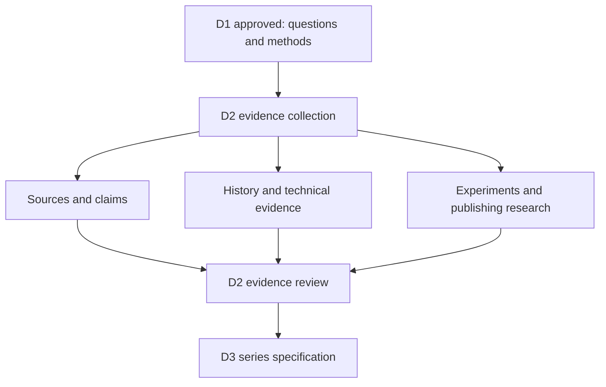

# Research-plan implications map

This is a compact view of what approval of D1 authorises and what remains
gated.

## Five research streams

| Stream | Principal output | Series purpose |
| --- | --- | --- |
| History and people | Sourced chronology and roles | Explain why the ideas emerged |
| Architecture | Mechanisms, guarantees, and boundaries | Establish what Nix actually does |
| Practice and adoption | Experiments, costs, and failure modes | Support a competent adoption judgement |
| Replayable development | Transferable ideas and missing layers | Earn the broader synthesis |
| Companion publication | Discovery, accessibility, and rights evidence | Make the audio-led work usable and durable |

## Evidence convergence

All streams feed a common dossier:

- a versioned source index;
- a claim and uncertainty register;
- a chronology and people map;
- architectural and ecosystem notes;
- specified experiments and retained results;
- publishing, accessibility, and rights findings; and
- a readable research synthesis.

D2 ends when further research is likely to add detail rather than change the
proposed series architecture. Material contradiction, unsafe experimentation,
rights dependencies, or a changed vision premise triggers a decision rather
than silent scope expansion.

## Boundaries after D1 approval

D2 evidence work is authorised. Series design remains gated by D2 review.
Scripts, audio, publication, external interviews, and a software demonstrator
remain unauthorised.
